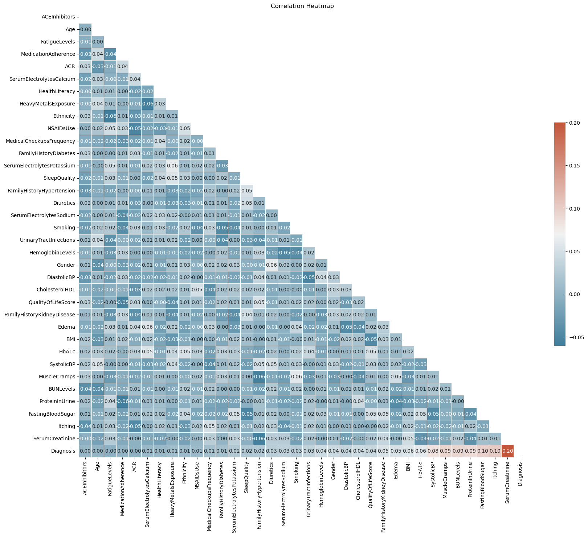
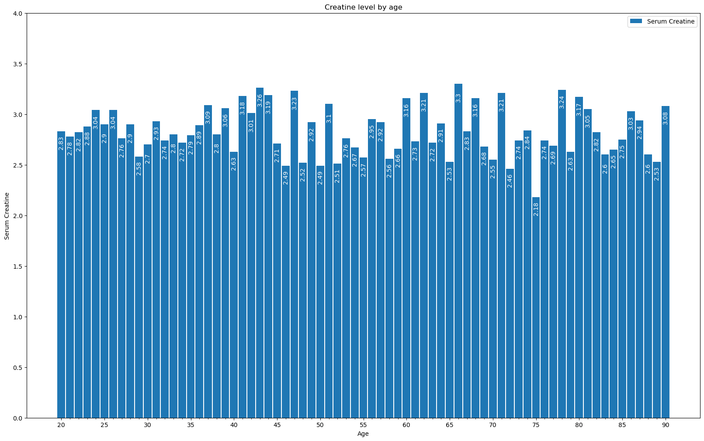

# Chronic Kidney Disease

[dataset-sourse](https://www.kaggle.com/datasets/rabieelkharoua/chronic-kidney-disease-dataset-analysis)

## introduction

This project look to explorer the possible cause of chronic kidney disease (CKS). The project analyzed the data from over 1500 patients that were diagnosed with CKS. The dataset includes information in different ares like demographic, lifestyle, medical history, medication, clinical measurements, symptoms, and health behaviors.

## Data Analysis

### Data Exploration

In this project we performed may analytic techniques; we looked a the correlation between positive diagnostics against the other features in the dataset, we looked at the avg, quantiles, min, and max of the different features.

### Data Finding

After analysis the data, we realize that there were very little relation between the possitive diagnosis and the other features. As we can see in the bellow graph, Serum Creatine has the highest correlation with a possitive diagnosis, but there is very little correlation between it and the other features.

#### Creatine correlation heatmap

 

We then looked at the how the level of Serum Creatine change with age, but we did not seen any clear indication that age contribute to the level of Serum Creatine, and therefore to a positive CKS diagnosis.

#### Creatine level by age hart

